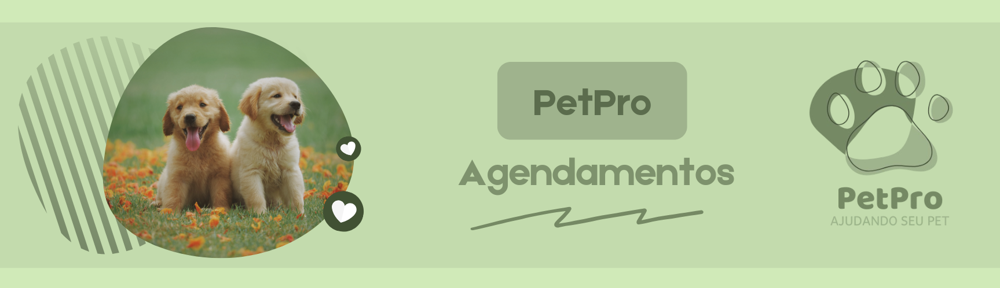

<h1 align="center">
    
</h1>

## PetPro - Ajudando seu Pet! 🐾 

Sistema que vai facilitar o agendamento de consultas de animais em veterinários.          

## Descrição          

O projeto PetPro visa virtualizar o ambiente veterinário criando um sistema que pode facilitar o agendamento de consultas para os animais de um usuário. 

➡️ Caso você seja um usuário, o sistema possibilitará para você uma visão ampla dos horários dísponíveis em determinado dia de seu veterinário favorito, 
tornando possível agendar seu pet sem a necessidade de ligações ou mais questões que impedem um agendamento rápido;

➡️ Caso você seja um veterinário, nosso sistema pobilitará que você visualize seus próximos clientes, em qual horário foi agendado, qual o tipo,
a raça, e a situação do paciente que vai ser analisado, em um programa de fácil acesso e visualização;

➡️ Caso você seja administrador, você poderá fazer a entrada, a retirada e alteração de veterinários e usuários do sistema;

➡️ E ainda assim, caso seja usuário você poderá entrar com um requisito emergencial, para situações mais graves que precisam de atendimento imediato.

## Motivo

Realizamos nosso projeto pensando em todos os donos de pet que já passaram por dificuldades ao agendar uma consulta de veterinário, por falta de organização,
disponibilidade, agilidade e entre outros nos agendamentos. Nosso sistema impede que esses problemas aconteçam e permite um ambiente de comunição mais agil,
seguro e rápido.h

## Histórias de Usuário

#### Usuário

👥 𝗖𝗼𝗺𝗼 dono(a) de pet, 𝗾𝘂𝗲𝗿𝗼 agendar uma consulta no veterinário 𝗽𝗮𝗿𝗮 um atendimento mais rápido;

👥 𝗖𝗼𝗺𝗼 dono(a) de pet, 𝗾𝘂𝗲𝗿𝗼 visualizar horários disponíveis 𝗽𝗮𝗿𝗮 um agendamento mais rápido;

#### Veterinário

👥 𝗖𝗼𝗺𝗼 veterinário, 𝗾𝘂𝗲𝗿𝗼 visualizar os pets agendados 𝗽𝗮𝗿𝗮 um atendimento rápido;

👥 𝗖𝗼𝗺𝗼 veterinário, 𝗾𝘂𝗲𝗿𝗼 visualizar quais são os pets em estado de emergência 𝗽𝗮𝗿𝗮 um atendimento justo;

#### Administrador

👥 𝗖𝗼𝗺𝗼 administrador, 𝗾𝘂𝗲𝗿𝗼 gerenciar os dados de veterinários e usuários 𝗽𝗮𝗿𝗮 um sistema funcional;

## Funcionalidades

#### Requisitos Funcionais
- [x] Administrador cadastrar pelo menos um veterinário favorito do usuário;
- [ ] Login / Logout ou cadastro manual do Usuário/Veterinário/Administrador
- [ ] Visualização pelo usuário do seu veterinário favorito, tais como seus horários disponíveis.
- [ ] Permitir ao usuário agendar seu pet dentro do horário disponível, e apenas no horário disponível, além de visualizar que seu pet está agendado;
- [ ] Permitir ao usuário alterar seus dados de Login;
- [ ] Permitir ao usuário o cancelamento de um consulta;
- [ ] Permitir a entrada do usuário como emergência;
- [ ] Possibilitar ao veterinário a visualização de quais são os pets (além de sua raça e situação médica) agendados nos horários não disponíveis ou os horários disponíveis;
- [ ] Possibilitar ao veterinário a visualização dos pets em estado emergencial, que precisam de mais atendimento;
- [ ] Possibilitar ao veterinário alterar os horários disponíveis, se preciso;
- [ ] Criar uma interface para o administrador que o possibilite fácil acesso aos usuários e aos veterinários.

#### Requisitos Não Funcionais
- [x] Acesso rápido por meio de arquivo instalador exe;
- [ ] Proteger contra acesso não autorizado.
- [ ] Criar um sistema que possibilite a segurança de dados, permitindo ao usuário e ao veterinário, e apenas eles, a alteração de dados importantes;
- [ ] Permitir confiabilidade do usuário com dados reais e contato direto com os veterinários;
- [ ] Ser compatível com o sistema operacional do Windows 10;
- [ ] Tentativa de conexão adequada e correta por meio do servidor xammp, ligando-a diretamente com o banco de dados sql;
- [ ] Estar conforme a Lei nº 13.709, de 14 de agosto de 2018, que visa a segurança de dados;
- [ ] Atenda as necessidades do usuário e do veterinário;

## 📸 Visuais e Telas 

## ⚙ Instalação   

Você fará o download do arquivo .zip, e por meio do arquivo .zip, você extrairá a pasta principal do arquivo e executará o arquivo .exe dentro dessa pasta, iniciando a aplicação do PetPro 

## Autores e reconhecimento     

-------------
 

  <table style="width:100%">
    <tr align=center>
      <th><strong>Giovanna Cirino</strong></th>
      <th><strong>Mayra Carlos</strong></th>
    </tr>
    <tr align=center>
      <td>
        
      </td>
      <td>
        
      </td>
    </tr>
  </table>

 
 
O projeto publicado em 2024 sobre a licença [MIT](./LICENSE) ❤️ 

Made with ❤️ by Giovanna e Mayra

Gostou? Deixe uma estrelinha para ajudar o projeto ⭐

- [Voltar ao Início](#index)
